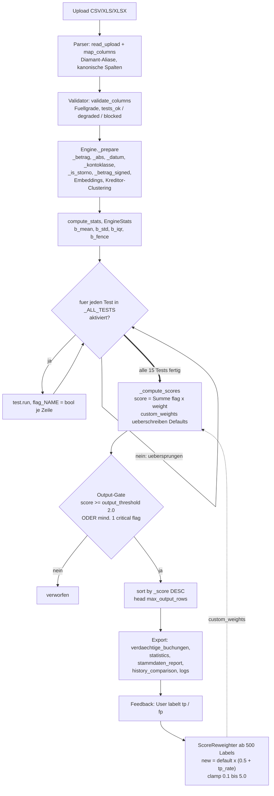
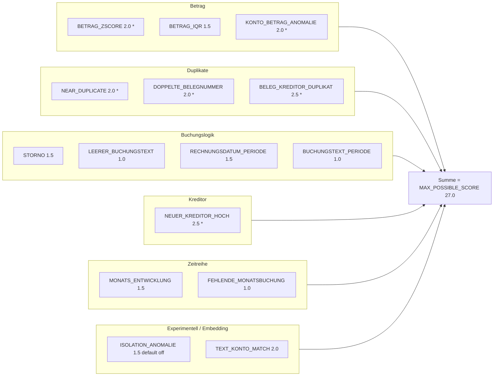

# Berechnungs-Workflow & Gewichtung

Dieses Dokument macht den Scoring-Mechanismus nachvollziehbar: **wie aus einer
hochgeladenen Buchungsdatei ein `anomaly_score` pro Buchung wird**, welche Tests
mit welchem Gewicht eingehen und wie Feedback die Gewichte nachjustiert.

Es ist **keine** Blackbox: Jede Buchung bekommt einen Score = gewichtete Summe der
ausgelösten Flags. Quellen sind unten mit `Datei:Zeile` referenziert.

---

## 1. Pipeline: von der Datei zum Score



**Wichtig:** Bei großen Dateien (≥ `PARALLEL_THRESHOLD`, Default 100.000 Zeilen)
laufen die 15 Tests parallel (Celery-`chord`), bei kleineren sequentiell — das
**Ergebnis ist identisch**, nur der Ausführungsweg unterscheidet sich
(`src/worker.py`).

---

## 2. Score-Berechnung

Pro Buchung wird der Score als **gewichtete Summe der ausgelösten Flags** gebildet
(`src/engine.py` → `_compute_scores`, ~Z.342):

```text
score(Buchung) = Σ  flag_X(Buchung) · weight(X)        für alle Tests X
                 X
```

- `flag_X` ist `1` wenn Test X die Buchung markiert, sonst `0`.
- `weight(X)` ist das Default-Gewicht aus `WEIGHTS` (`src/engine.py:53`) — oder ein
  vom Feedback gelerntes Gewicht aus `config.custom_weights`, falls vorhanden.
- **Keine Normalisierung:** Der Score liegt in `[0, MAX_POSSIBLE_SCORE]` mit
  `MAX_POSSIBLE_SCORE = 27.0` (Summe aller Gewichte, `src/engine.py:57`).

### Output-Gate (`_export`, ~Z.372)

Eine Buchung erscheint im Ergebnis, wenn **eine** der Bedingungen gilt:

1. `score ≥ output_threshold` (Default **2.0**, konfigurierbar), **oder**
2. mindestens ein **kritisches** Flag (★) ist gesetzt.

Danach: absteigend nach Score sortiert, auf `max_output_rows` gekappt
(Default 0 = unbegrenzt; UI/Worker nutzen Top 1.000).

---

## 3. Die 15 Tests & ihre Gewichte

★ = **kritisch** → die Buchung erscheint immer im Output, unabhängig vom Score.



| Flag | Gewicht | Kritisch | Was es prüft |
| ---- | :-----: | :------: | ------------ |
| `BETRAG_ZSCORE` | 2.0 | ★ | Betrag > z·σ vom Mittel (nur Ertrag/Aufwand) |
| `BETRAG_IQR` | 1.5 | | Betrag über IQR-Fence (Q3 + Faktor·IQR) + Mindestbetrag |
| `KONTO_BETRAG_ANOMALIE` | 2.0 | ★ | Betrag weicht > σ vom Konto-Durchschnitt ab |
| `NEAR_DUPLICATE` | 2.0 | ★ | Gleicher Betrag+Konto/Kreditor ≤ N Tage (+ Text-Ähnlichkeit) |
| `DOPPELTE_BELEGNUMMER` | 2.0 | ★ | Belegnummer mehrfach (mit Soll/Haben-Paar-Ausschluss) |
| `BELEG_KREDITOR_DUPLIKAT` | 2.5 | ★ | Beleg+Kreditor+Betrag mehrfach / Kreditor+Betrag+Datum ≤ Fenster |
| `STORNO` | 1.5 | | Storno ohne GU-Referenz / Gutschrift mit hohem Betrag |
| `LEERER_BUCHUNGSTEXT` | 1.0 | | Buchungstext leer/generisch/≤ 2 Zeichen |
| `RECHNUNGSDATUM_PERIODE` | 1.5 | | Rechnungs-/Erfassungsmonat ≠ Buchungsmonat (> 2 Monate) |
| `BUCHUNGSTEXT_PERIODE` | 1.0 | | Periode im Buchungstext ≠ Buchungsdatum |
| `NEUER_KREDITOR_HOCH` | 2.5 | ★ | Neuer Kreditor (≤ 2 Buchungen) mit hohem Betrag |
| `MONATS_ENTWICKLUNG` | 1.5 | | Monatssumme pro Konto > z·σ |
| `FEHLENDE_MONATSBUCHUNG` | 1.0 | | Regulär aktives Konto fehlt in einem Monat |
| `ISOLATION_ANOMALIE` | 1.5 | | Isolation-Forest Catch-All (experimentell, default **aus**) |
| `TEXT_KONTO_MATCH` | 2.0 | | Buchungstext passt nicht zur Kontobezeichnung (Sachkonto 40000–79999) |

Gewichte sind die Single Source of Truth in `WEIGHTS` (`src/engine.py:53`), abgeleitet
aus den `weight`/`critical`-Attributen der Test-Klassen unter `src/tests/`.

---

## 4. Welche Tests laufen? (Validator)

Vor der Analyse prüft `validate_columns` (`src/validator.py`) die Spalten-Füllgrade
und teilt jeden Test ein:

- **ok** — alle benötigten Spalten befüllt → läuft.
- **degraded** — Pflichtspalte dünn (< 50 %) oder optionale Spalte leer → läuft eingeschränkt.
- **blocked** — Pflichtspalte komplett leer → wird in der UI automatisch deaktiviert.

Beispiel `RECHNUNGSDATUM_PERIODE`: braucht `erfassungsdatum` **oder** `buchungsperiode`
(`required_any`). Fehlen beide (typisch im Diamant-Export), wird der Test **blockiert**
statt still 0 Treffer zu liefern.

---

## 4b. Globaler Konto-Bereichsfilter (GuV)

Die Anomalie-Erkennung zielt fachlich auf **GuV-Konten**: Ertrag (40000–59999) +
Aufwand (60000–79999). Bestandskonten (< 40000, Bilanz) und Kostenrechnung
(≥ 80000, intern) sind kein Prüfziel — dort sind z. B. Z-Score/IQR auf Beträgen
sinnlos (technische Umbuchungen, keine Geschäftsvorfälle).

Deshalb gibt es **einen** Konto-Bereichsfilter, der für **alle 15 Tests gleich** gilt
(`konto_filter_min`/`konto_filter_max`, Default 40000–79999; `konto_filter_enabled=False`
= alle Konten). Implementiert als Maske `_konto_in_scope` in `_prepare`:
konto-bewusste Tests (Betrag, MONATS, LEERER, TEXT_KONTO) lesen sie direkt, und in
`_compute_scores` werden Flags außerhalb des Bereichs zentral genullt — so wirkt der
Filter einheitlich auf jeden Test (die Detektion behält dabei den Cross-Konto-Kontext,
z. B. für Duplikate). Früher war das inkonsistent (Betrag hardcoded, TEXT_KONTO separat,
Rest gar nicht) — jetzt eine Wahrheit, in der UI einstellbar.

## 4c. Gewichte in der UI anpassen

Pro Test lassen sich in der UI **An/Aus** (läuft / läuft nicht) und das **Gewicht**
(0.1–5.0) einstellen. Die Gewichte gehen als `config.custom_weights` direkt in
`_compute_scores` ein (überschreiben die Defaults für den Lauf). Ein Button lädt die
vom Feedback-Trainer gelernten Gewichte (`ScoreReweighter`, ab 500 Labels) in die
Slider, ein anderer setzt auf die Defaults zurück.

---

## 5. Feedback-Schleife (lernende Gewichte)

Prüfer labeln Buchungen als `tp` (echte Anomalie), `fp` (Fehlalarm) oder `unsure`
(`src/feedback.py`). Ab **500 Labels** berechnet der `ScoreReweighter`
(`src/trainer.py`) pro Flag eine neue Gewichtung:

```text
tp_rate = tp / (tp + fp)
neues_gewicht = default_gewicht · (0.5 + tp_rate)      geklemmt auf [0.1, 5.0]
```

- 100 % True Positives → Gewicht × 1.5 (hochgestuft)
- 50/50 → unverändert
- 100 % False Positives → Gewicht × 0.5 (halbiert)

Die gelernten Gewichte fließen als `config.custom_weights` zurück in `_compute_scores`
und überschreiben dort die Defaults — der Kreis schließt sich (siehe Pipeline-Diagramm).

---

## Quellen

| Aspekt | Datei:Zeile |
| ------ | ----------- |
| Gewichte (`WEIGHTS`, `MAX_POSSIBLE_SCORE`) | `src/engine.py:53`, `:57` |
| Score-Formel | `src/engine.py` → `_compute_scores` |
| Output-Gate + Sortierung | `src/engine.py` → `_export` |
| Spalten-Validierung | `src/validator.py` → `validate_columns` |
| Sachkonto-Range (TEXT_KONTO_MATCH) | `src/config.py` (`text_konto_konto_min/max`) |
| Feedback-Reweighting | `src/trainer.py`, `src/feedback_stats.py` |
| Parallel vs. sequentiell | `src/worker.py` |
