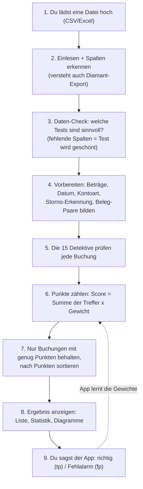

# Wie funktioniert der Pre-Filter? (einfach erklärt)

> Diese Seite erklärt die ganze App so, dass man sie ohne Vorwissen versteht.
> Die technische Detail-Doku steht in [`BERECHNUNG.md`](BERECHNUNG.md) und im
> [README](../README.md).

## Die Idee in einem Satz

Eine Firma bucht jeden Monat **tausende** Geldbewegungen. Ein Mensch kann nicht
jede einzeln prüfen. Diese App ist wie ein **schneller Helfer, der alle Buchungen
durchliest und nur auf die wenigen „komisch aussehenden" einen Zettel klebt** —
damit ein Prüfer nur diese anschauen muss, statt alles.

Wichtig: Die App **entscheidet nichts** und löscht nichts. Sie sagt nur „schau dir
diese hier mal genauer an". Ein Mensch entscheidet am Ende.

## Das große Bild

Stell dir einen **Lehrer vor, der einen Stapel Hausaufgaben korrigiert**. Er hat
eine Liste von Dingen, auf die er achtet („Name vergessen?", „Datum falsch?",
„zweimal dasselbe abgegeben?"). Jeder gefundene Fehler gibt **Minuspunkte**. Am
Ende legt er die Blätter mit den meisten Minuspunkten nach oben — die schaut er
zuerst an.

Genau das macht die App: Die „Dinge, auf die geachtet wird" heißen hier **Tests**
(15 Stück). Die Minuspunkte heißen **Score**. Buchungen mit hohem Score landen oben.

## Der Weg einer Datei — Schritt für Schritt

## Die 15 Detektive (Tests)

Jeder Detektiv prüft **eine** Sache. Findet er etwas, klebt er seinen Zettel an die
Buchung. ⭐ = besonders wichtig (so eine Buchung kommt **immer** auf den Prüf-Stapel).

| Detektiv (Test) | Prüft, ob… | Punkte | ⭐ |
| --- | --- | --- | --- |
| BETRAG_ZSCORE | der Betrag viel größer/kleiner ist als sonst üblich | 2.0 | ⭐ |
| BETRAG_IQR | der Betrag ein extremer Ausreißer ist | 1.5 | |
| KONTO_BETRAG_ANOMALIE | der Betrag für **dieses Konto** ungewöhnlich ist | 2.0 | ⭐ |
| NEAR_DUPLICATE | fast dieselbe Buchung kurz hintereinander vorkommt | 2.0 | ⭐ |
| DOPPELTE_BELEGNUMMER | dieselbe Belegnummer mehrfach auftaucht | 2.0 | ⭐ |
| BELEG_KREDITOR_DUPLIKAT | derselbe Lieferant evtl. doppelt bezahlt wurde | 2.5 | ⭐ |
| STORNO | es eine Storno-/Rückbuchung ist (auffällig) | 1.5 | |
| LEERER_BUCHUNGSTEXT | der Text fehlt oder nichtssagend ist („diverse") | 1.0 | |
| RECHNUNGSDATUM_PERIODE | Rechnungsmonat ≠ Buchungsmonat (Periode verschoben) | 1.5 | |
| BUCHUNGSTEXT_PERIODE | im Text ein anderer Monat steht als gebucht | 1.0 | |
| NEUER_KREDITOR_HOCH | ein **neuer** Lieferant gleich einen hohen Betrag bekommt | 2.5 | ⭐ |
| MONATS_ENTWICKLUNG | eine Monatssumme aus der Reihe tanzt | 1.5 | |
| FEHLENDE_MONATSBUCHUNG | eine sonst regelmäßige Buchung in einem Monat fehlt | 1.0 | |
| ISOLATION_ANOMALIE | eine KI sie insgesamt „seltsam" findet (Experiment, standardmäßig aus) | 1.5 | |
| TEXT_KONTO_MATCH | der Buchungstext nicht zur Kontobezeichnung passt | 2.0 | |

## Der Verdachts-Stempel (Score)

- Jeder Detektiv-Zettel gibt **Punkte** (sein „Gewicht").
- Alle Punkte einer Buchung werden **zusammengezählt** → das ist der **Score**.
- Ab **2 Punkten** (oder bei einem ⭐-Treffer) kommt die Buchung auf den Prüf-Stapel.
- Höchstmöglich sind **27 Punkte** (alle Detektive zusammen). Angezeigt werden die
  Top-Treffer, sortiert von „am verdächtigsten" nach unten.

Beispiel: Eine Buchung mit `DOPPELTE_BELEGNUMMER` (2.0) **und** `NEUER_KREDITOR_HOCH`
(2.5) hat **4.5 Punkte** → landet weit oben.

## Welche Konten zählen? (GuV-Filter)

Eine Firma hat verschiedene Konto-Arten. Geprüft werden standardmäßig nur die, wo
„echtes Geschäft" passiert (**GuV-Konten**, Nummern **40000–79999** = Einnahmen +
Ausgaben). Konten für z. B. Bankguthaben (unter 40000) oder interne Verrechnung
(ab 80000) werden übersprungen — dort wären die Tests sinnlos.

Das kannst du in der App umstellen („Konten-Bereich" / „Alle Konten einbeziehen").
Es gilt **für alle Detektive gleich**.

## Die App lernt dazu

In der Ergebnis-Liste trägst du bei jeder Buchung ein:
- **tp** = „richtig erkannt" (echte Auffälligkeit)
- **fp** = „Fehlalarm" (war harmlos)
- **unsure** = „weiß nicht"

Wenn genug Bewertungen da sind (500), kann die App die **Punkte (Gewichte)
nachjustieren**: Detektive, die oft danebenliegen, bekommen weniger Gewicht;
zuverlässige mehr. Du kannst die Gewichte auch **selbst per Schieberegler** setzen.

## Die Knöpfe und Tabs in der App

- **Datei hochladen** + (optional) **Webhook-URL** (Ergebnis automatisch weiterschicken).
- **📋 Datenqualitäts-Check**: zeigt, welche Tests laufen, eingeschränkt oder geblockt
  sind — plus ℹ️-Infos zum Datenmodell (z. B. „Diamant hat kein Gegenkonto, das ist normal").
- **⚙️ Erweiterte Einstellungen**: Schieberegler für Empfindlichkeit + Konten-Bereich.
- **🔧 Test-Konfiguration & Gewichte**: jeden Detektiv an/aus + Gewicht; Knöpfe
  „Defaults" und „Gelernte Gewichte laden".
- **▶️ Analyse starten** / **⛔ Abbrechen**.
- Ergebnis-Tabs:
  - **Ergebnis**: kurze Zusammenfassung.
  - **Verdächtige Buchungen**: die Tabelle + dein tp/fp-Feedback.
  - **📜 Live-Log**: was die App gerade macht (live).
  - **📊 Visualisierungen**: fertige Diagramme (Score-Verteilung, Top-Konten …).
  - **🔬 Eigene Visualisierung**: eigenes Diagramm aus beliebigen Spalten bauen.
  - **📁 History**: frühere Läufe ansehen.
  - **📈 Feedback-Stats**: wie gut die Detektive laut deinen Bewertungen sind.

## Hinter den Kulissen (für Neugierige)

- **Einlesen & Spalten erkennen** (`parser.py`): erkennt deutsche Zahlen (1.234,56),
  verschiedene Datumsformate und ordnet Diamant-Spalten den richtigen Namen zu.
- **Beleg-Paare** (`engine.find_counterpart_rows`): Diamant speichert pro Buchung nur
  **ein** Konto; das Gegenkonto steht in einer zweiten Zeile mit derselben Beleg-ID.
  Die App fügt diese Paare gedanklich zusammen.
- **Vorzeichen** (`accounting.py`): rechnet Soll/Haben in „+ Einnahme / − Ausgabe" um.
- **KI-Textvergleich** (`embeddings.py`): wandelt Texte in Zahlen-Vektoren um, um
  Ähnlichkeit zu messen (für NEAR_DUPLICATE und TEXT_KONTO_MATCH).
- **Lieferanten aufräumen** (`kreditor_clustering.py`): erkennt, dass „Müller GmbH"
  und „Mueller G.m.b.H" derselbe Lieferant sind.
- **History** (`history.py`): speichert jeden Lauf und vergleicht mit dem letzten.
- **Webhook** (`webhook.py`): schickt das Ergebnis (gekürzt) an einen Langdock-Agenten.

## Schnell oder normal? (Worker)

- Kleine Dateien: die App rechnet **direkt** (sequentiell).
- Große Dateien (ab 100.000 Zeilen): die Arbeit wird auf **mehrere Helfer verteilt**
  (Celery-Worker mit Redis) und parallel gerechnet — das Ergebnis ist identisch.
- Ohne Redis läuft alles im **lokalen Fallback-Modus** direkt im Browser-Prozess.

## Zwei Türen hinein

1. **Web-Oberfläche** (Gradio, Port 7864): die bunten Knöpfe für Menschen.
2. **Roboter-Schnittstelle** (FastAPI REST, Port 8000): für andere Programme
   (`POST /api/jobs`, Status abfragen, Live-Logs). `GET /health` sagt „ich lebe",
   `GET /healthz` prüft zusätzlich die Redis-Verbindung.
